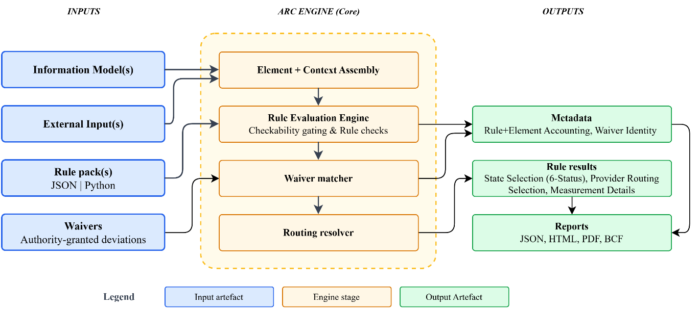
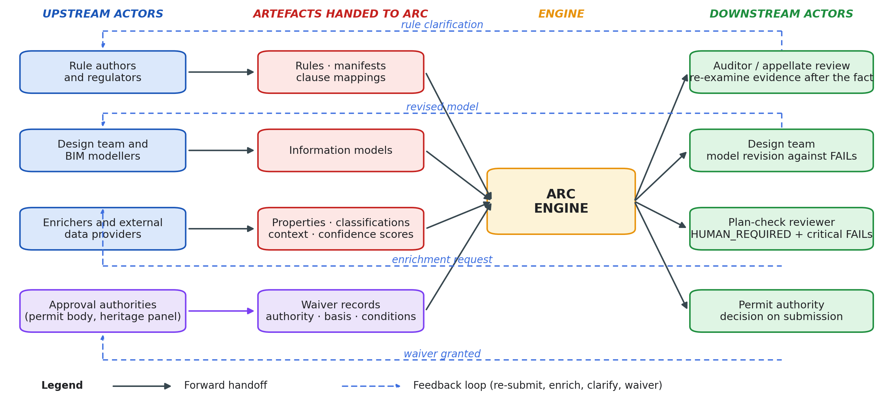
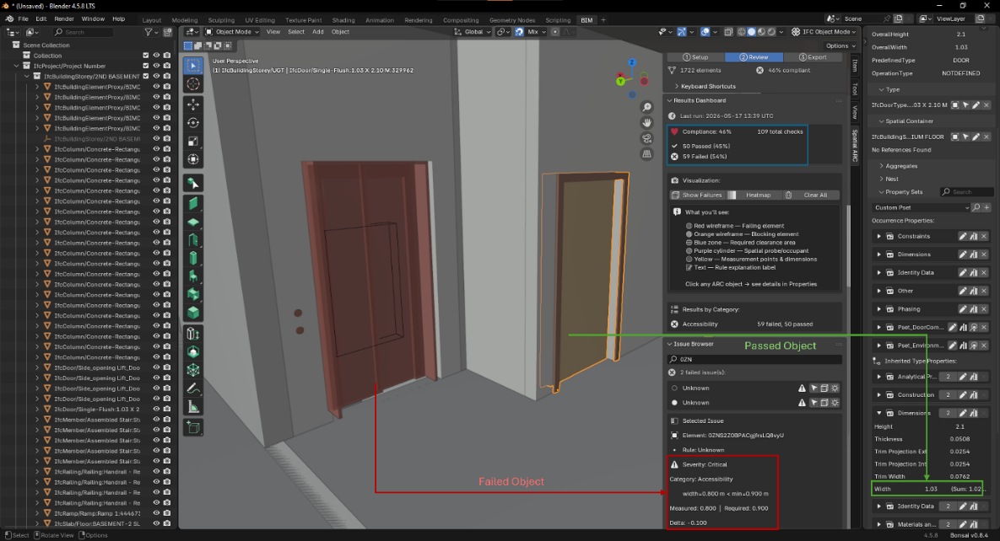
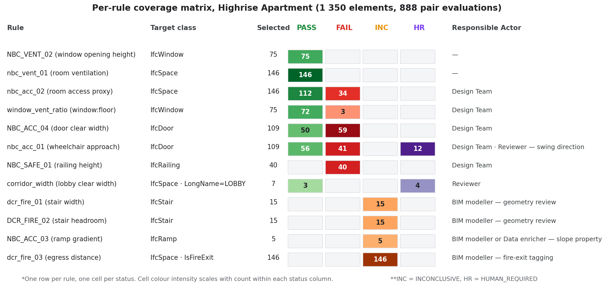
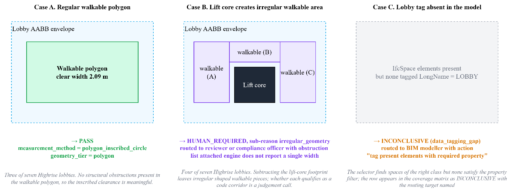

# ARC - Assessable Regulatory Compliance for Building Models

**Open-source compliance *evidence* engine with a clean Core/Spatial separation - a pure-Python rule engine with zero BIM dependencies, plus an optional Blender 4.2+ spatial extension.**

ARC generates structured compliance evidence from IFC building models - not verdicts. Humans retain compliance authority. ARC makes the checking process transparent, repeatable, and auditable. **ARC-Core** runs anywhere Python runs (CI, servers, notebooks); **ARC-Spatial** adds Blender visualization and IFC integration.

This repository is the reference implementation accompanying the DBP26 paper:

> Nanduri, S.K., Karmakar, A., & Delhi, V.S.K. (2026). *ARC: Open infrastructure towards assessable regulation compliance checking.* International Conference on Digital Building Permits (DBP26), Munich. Taylor & Francis (CRC Press).

Version `0.1.0` corresponds to the evaluation reported in that paper. `uv.lock` records the exact dependency versions used for the reported runs.

---

## What ARC Does

Given an IFC building model and a set of regulation rules, ARC:

1. **Classifies** every (rule, element) pair *before* checking - reporting what CAN vs CANNOT be assessed, and why
2. **Executes** spatial compliance checks (dimensions, clearances, ratios, topology, proximity)
3. **Produces** transparent evidence per finding - geometry tier, measurement method, confidence, assumptions
4. **Routes** every unresolved case to a responsible next actor
5. **Reports** in JSON, HTML, PDF, and BCF formats with full coverage analysis



### The 6-Status Taxonomy

| Status | Meaning | Subsequent action |
|---|---|---|
| **PASS** | The requirement is satisfied | No action required |
| **FAIL** | The requirement is violated | Revise the model or data, or review whether a valid waiver applies |
| **INCONCLUSIVE** | Subject and capability exist, but required geometry, properties, or external inputs are missing | Supply the missing input and re-run |
| **HUMAN_REQUIRED** | The requirement depends on expert judgment | Route to the appropriate reviewer or authority |
| **NOT_APPLICABLE** | The rule has no subject in this model, stage, or building type | Record the reason and continue |
| **UNSUPPORTED** | A subject exists, but the check type is not registered | Add or connect the required checking capability |

The statuses are mutually exclusive by construction: checkability gates run in a fixed order in the engine, and the first failing gate determines the status. The decision logic lives in the engine, not in individual rules.

Every non-PASS/FAIL status maps to a responsible actor and a suggested action - gaps become accountable tasks, not anonymous data holes.



---

## Quick Start

Full setup, dependency, verification, and troubleshooting instructions are in **[INSTALL.md](INSTALL.md)**. The short version:

### Option A: pip install (CLI)

```bash
# Create environment and install
uv venv && source .venv/bin/activate   # Windows: .venv\Scripts\activate
uv pip install -e ".[dev]"
uv pip install ifcopenshell             # for IFC file loading

# Run with demo elements (no IFC needed)
arc-check --demo

# Run against the bundled example models
arc-check --ifc examples/models/sample-house.ifc --output results/
arc-check --ifc examples/models/highrise-apartment.ifc --stage submission --output results/

# Federated models (multiple IFC files)
arc-check --ifc arch.ifc struct.ifc --disciplines architectural,structural

# Filter by regulation date
arc-check --ifc model.ifc --regulation-date 2024-06-01

# Delta comparison against baseline
arc-check --ifc model.ifc --baseline results/compliance_results.json

# List available rule packs
arc-check --list-packs
```

### Option B: Blender Extension

```bash
# Blender 4.2+  -> arc-0.1.0.zip
python scripts/build_addon.py
# Blender <=4.1 -> arc-0.1.0-legacy.zip
python scripts/build_addon.py --legacy

# Install in Blender 4.2+:
# Edit > Preferences > Get Extensions > Install from Disk > select arc-0.1.0.zip
# Blender installs the bundled wheels automatically on first enable.
# The N-panel appears under View3D > Sidebar > Spatial ARC
# Requires the Bonsai BIM add-on to import IFC files.
```

Verified end to end on **Blender 4.5 LTS** (Python 3.11) and **Blender 5.1**
(Python 3.13). The bundled wheels are pure-Python, so one zip covers both. For
Blender 4.1 and older, build the legacy zip; if that gives trouble, Option C
below needs no Blender at all.

PDF export inside Blender needs `pillow` installed into Blender's own Python -
it is not bundled, for the wheel-matrix reason above. Every other output format
works out of the box.

The Blender extension surfaces the same result records as the CLI - the selected object, status, measured value, required value, and severity are linked to the model element being checked:



### Option C: Headless (runs anywhere)

Run from a clone without installing ARC as a package. The required `networkx`
dependency must still be available; `uv run --frozen` supplies the locked
environment automatically:

```bash
uv run --frozen python run_checks.py --demo
uv run --frozen --extra ifc python run_checks.py --ifc examples/models/sample-house.ifc --output results/

# Or, after installing the dependencies, use Python directly
python run_checks.py --demo

# Inside Blender's own Python, any supported version
blender --background --python run_checks.py -- --demo
```

Both the pip CLI and the Blender extension share `arc/core/`. The Blender extension additionally uses `arc/spatial/`.

---

## Architecture

```
arc/
  __init__.py                    # Top-level: version, Blender register/unregister delegation
  core/                          # ARC-Core: pure Python, zero BIM dependencies
    cli.py                       # CLI entry point (arc-check)
    rule_engine.py               # Check types, checkability gates, evidence bundles
    data_models.py               # 6-status taxonomy, EvidenceBundle, CoverageGap, WaiverRecord
    rule_loader.py               # JSON + Python rule loading, clause ledger, pack manifests
    geo_engine.py                # AABB + KD-tree + Shapely polygon tiers
    topology_engine.py           # Connectivity graph + pathfinding
    context.py                   # Execution context: elements + spatial index + topology
    report_generator.py          # JSON/HTML/PDF reports with coverage sections
    bcf_exporter.py              # BCF issue export
    validators.py                # External data validation
    delta.py                     # Delta comparison
    extensions.py                # Entry-point extension protocol
    registry.py                  # Rule pack registry
    config.py                    # Configuration + tolerances
    base_rule.py                 # Base rule descriptor
    semantic_layer.py            # Semantic enrichment layer
    rules/
      json_rules/                # Declarative JSON rules
      python_rules/              # Programmatic Python rules
      clause_ledger.json         # Regulation clause -> rule mapping (incl. exclusions)
      pack_manifest.json         # Rule pack metadata
  spatial/                       # ARC-Spatial: Blender 4.2+ extension
    __init__.py                  # Blender registration, keymaps
    operators.py                 # Blender operators
    ui_panel.py                  # N-panel UI
    visualizer.py                # Compliance volume visualization
    ifc_integration.py           # IFC loading (Blender + headless)
    install.py                   # Dependency installer
```

**ARC-Core** (`arc/core/`) has **zero** Blender/IFC imports - it runs anywhere Python runs. **ARC-Spatial** (`arc/spatial/`) contains all Blender-dependent modules and guards `import bpy` behind `try/except`, making them inert outside Blender.

Adapters for other information models translate their data into the ARC core schema; the IFC adapter (IfcOpenShell) is the reference implementation.

---

## Built-in Check Types

| Check Type | What It Checks | Context |
|------------|---------------|---------|
| `min_area` | Floor area >= threshold | Geometry |
| `min_width` | Minimum horizontal dim >= threshold | Geometry |
| `min_height` / `max_height` | Vertical dim within range | Geometry |
| `min_dimensions_2d` | Both horizontal dims meet thresholds | Geometry |
| `property_min` / `property_max` | Property value within range | Property only |
| `ratio` | Ratio of two measures in range | Property only |
| `clearance_zone` | No blocking elements within padding | Cross-element |
| `turning_circle` | Inscribed circle fits footprint | Geometry |
| `distance_to_nearest` | Min distance to target class | Cross-element |
| `count_nearby` | Count of nearby elements in range | Cross-element |

Four further check types are **aggregate-scope** - they receive the whole matched element set and emit a single class- or model-scope result with `affected_element_ids` populated, rather than one result per element:

| Check Type | What It Checks |
|------------|---------------|
| `count` | Number of matched elements meets a threshold |
| `sum_property` | Summed property value across matched elements |
| `any_pass` | At least one matched element satisfies the condition |
| `all_pass` | Every matched element satisfies the condition |

Aggregate rows are reported on their own axis and are visually marked in the HTML report, so they are never mistaken for per-element findings.

To add a check type: call `register_check_type()` or publish an entry-point extension. See [docs/integrator-guide.md](docs/integrator-guide.md).

---

## Rule Authoring

### JSON (declarative, portable)

```json
{
  "id": "NBC_ACC_04",
  "title": "Door Clear Width",
  "selector": {"ifc_class": "IfcDoor"},
  "check_type": "min_width",
  "params": {"min_width": 0.9},
  "severity": "critical",
  "category": "accessibility",
  "source": "NBC 2016, Part 3 Section 4.3.1",
  "jurisdiction": "India",
  "interpretation_notes": "Clear width as minimum unobstructed opening."
}
```

### Python (expressive, full logic)

```python
def check(context, element):
    width = element.properties.get("Width", 0)
    if width >= 1.5:
        return {"passed": True, "message": f"Width {width}m meets minimum"}
    return {"passed": False, "message": f"Width {width}m below 1.5m minimum"}
```

Place JSON rules in `arc/core/rules/json_rules/`, Python rules in `arc/core/rules/python_rules/`. Python rules are statically screened and executed in a restricted namespace; rule packs are treated as trusted, governed artifacts and carry a manifest with identifier, version, jurisdiction, and governance status.

Full guide: [docs/rule-authoring-guide.md](docs/rule-authoring-guide.md).

---

## Waivers

A waiver is an authority-granted acceptance of a non-conforming or conditionally conforming case. ARC records waivers as structured authority records - they **annotate, never alter** the technical result. A FAIL with a valid waiver stays a FAIL in the evidence record, with the waiver attached as a separate authority decision.

Matching is exact on a five-part identity (rule pack, rule, rule version, element, project) combined with expiry and occasion conditions. Waivers are re-validated on every run and never short-circuit checking:

- **applied** - matched and in force
- **invalid** - stale or foreign, with the invalidation reason recorded
- **superseded** - the underlying check now passes

```bash
arc-check --ifc examples/models/highrise-apartment.ifc \
          --stage submission \
          --waivers examples/waivers/waiver_records.json
```

`examples/waivers/waiver_records.json` holds the four synthetic records used in the paper (valid / expired / project-identity mismatch / superseded). No public authority waiver dataset was available, so these are constructed against real findings from the high-rise run.

---

## Reports Generated

| Format | Contents |
|--------|----------|
| **JSON** | Full payload: results with evidence, coverage gaps, clause coverage, evidence summary |
| **HTML** | Visual dashboard: 6-status bar, checkability metric, failure cards, coverage tables |
| **PDF** | Print-ready: executive summary, charts, failures, coverage gaps, clause coverage |
| **BCF** | BIM Collaboration Format issues with spatial coordinates |
| **Terminal** | 6-status summary with checkability and coverage gap count |

JSON, HTML, and BCF need no optional packages. **PDF requires both `reportlab`
and `pillow`** - reportlab 4.x imports PIL internally, so installing reportlab
alone is not enough. pillow ships platform- and Python-version-specific wheels
and is therefore not bundled with the Blender extension; see
[INSTALL.md](INSTALL.md#pdf-skipped-install-reportlab-and-pillow-for-pdf-output).
Without it ARC simply reports `PDF skipped` and writes the other three formats.

A committed sample of the `--demo` output is in [examples/reference-output/](examples/reference-output/) so you can see the shape of the results without running anything.

---

## Reference Evaluation (v0.1.0)

Two IFC4 models, a 12-rule pack (5 declarative JSON + 7 executable Python) derived from NBC 2016 and Mumbai DCPR 2034, submission stage:

| Model | Pairs | PASS | FAIL | INCONCLUSIVE | HUMAN_REQUIRED |
|---|---|---|---|---|---|
| Sample house (42 elements) | 26 | 18 | 4 | 4 | 0 |
| High-rise apartment (1,350 elements) | 888 | 514 | 177 | 181 | 16 |

For the high-rise run, 691 pairs (78%) received a decided PASS or FAIL verdict, and 140 of the FAIL findings carried critical severity. Waiver processing left pair-axis counts unchanged, with FAIL totals fully visible at 176 open and one waived.

Reproduce with:

```bash
arc-check --ifc examples/models/sample-house.ifc --stage submission
arc-check --ifc examples/models/highrise-apartment.ifc --stage submission
```

The coverage matrix below reports workflow state rather than only a compliance score - which rules were active, which elements were checked, why unresolved cases remain unresolved, and who should act next:



The lobby-width rule (NBC 2016 Part 3, clause 4.3.2) shows how one requirement yields different statuses depending on geometry and model tagging:



**Scope caveat:** the 12-rule pack is a purposive selection chosen to exercise all six statuses and the full check-type spectrum. It is not a claim of regulatory coverage for any jurisdiction, and the evaluation validates functionality rather than effectiveness. Professional correctness remains to be evaluated against expert-labelled cases.

---

## Testing

```bash
python -m pytest tests/ -q                         # full suite
python -m pytest tests/core/test_regression.py -q  # regression only
```

Expected: **157 passed, 1 skipped** (the skip is a Blender-only path). The suite covers the checkability gates, the six-status assignment, routing, waiver identity matching, delta comparison, and the reporting payloads - it is the fastest way to confirm the engine behaves as described in the paper. See [INSTALL.md](INSTALL.md#verifying-the-install) for reproducing the paper's evaluation numbers.

---

## Technology Stack

| Component | Role |
|-----------|------|
| Python 3.10+ | Core language |
| NetworkX | Topology graph, pathfinding |
| IfcOpenShell | IFC parsing (optional) |
| Shapely | Polygon geometry tier (optional) |
| ReportLab + Pillow | PDF reports (optional; both required together) |
| Blender 4.2+ | Spatial visualization (optional) |

---

## Documentation

| Document | Path |
|----------|------|
| Installation & Verification | [INSTALL.md](INSTALL.md) |
| User & Developer Guide | [docs/user-and-developer-guide.md](docs/user-and-developer-guide.md) |
| External Integrator Guide | [docs/integrator-guide.md](docs/integrator-guide.md) |
| Platform Architecture | [docs/architecture.md](docs/architecture.md) |
| Rule Authoring Guide | [docs/rule-authoring-guide.md](docs/rule-authoring-guide.md) |
| Rule Type Taxonomy | [docs/rule-type-taxonomy.md](docs/rule-type-taxonomy.md) |
| Data Quality Playbook | [docs/data-quality-playbook.md](docs/data-quality-playbook.md) |
| Modelling Workflow Guide | [docs/modelling-workflow-guide.md](docs/modelling-workflow-guide.md) |
| Data Model Schema | [docs/specifications/data-model-schema.md](docs/specifications/data-model-schema.md) |
| API Contract | [docs/specifications/api-contract.md](docs/specifications/api-contract.md) |
| All specifications | [docs/specifications/](docs/specifications/) |
| Contributing | [CONTRIBUTING.md](CONTRIBUTING.md) |
| Example models & provenance | [examples/models/README.md](examples/models/README.md) |
| Regulation sources | [regulations/README.md](regulations/README.md) |
| Third-party notices | [THIRD-PARTY-NOTICES.md](THIRD-PARTY-NOTICES.md) |

---

## Repository Layout

```
INSTALL.md      setup, verification, troubleshooting
CONTRIBUTING.md how to get involved, engine invariants
arc/            engine (core + spatial)
docs/           guides, specifications, figures
examples/       IFC models (see models/README.md), waiver records, reference output
regulations/    source-document provenance (PDFs not redistributed)
scripts/        Blender extension build script
tests/          test suite
```

---

## Contributing

ARC is built so that most useful work needs **no changes to the core engine** -
jurisdiction rule packs, check types, model adapters, enrichment and simulation
services, and integrations are all external extension points.

```bash
pip install -e ".[dev]"
python -m pytest tests/ -q        # expect 157 passed, 1 skipped
```

Read **[CONTRIBUTING.md](CONTRIBUTING.md)** before opening a pull request - it
lists where help is most valuable, and the engine invariants that must not break
(evidence not verdicts; engine-enforced statuses; waivers annotate but never
alter; `arc/core/` stays free of Blender and IFC imports).

The [External Integrator Guide](docs/integrator-guide.md) documents nine external
actor categories with worked examples: Revit, Speckle, CI/CD, web services,
enrichment and simulation providers, quality gates, human-in-the-loop review, and
**AI agents** consuming ARC as a feedback contract for automated model remediation.

---

## License

ARC is split by licence along the same line as its architecture:

| Part | Path | Licence |
|---|---|---|
| **ARC-Core** | `arc/core/`, `run_checks.py`, `tests/core/` | **Apache-2.0** |
| **ARC-Spatial** | `arc/spatial/`, `arc/__init__.py`, `scripts/build_addon.py`, `tests/spatial/` | **GPL-3.0-or-later** |

**ARC-Core is permissively licensed.** It contains no Blender and no IFC imports, so you can vendor the rule engine, evidence model and reporting into proprietary or differently licensed software under Apache-2.0 terms.

**ARC-Spatial is GPL** because it is a Blender add-on, and Blender requires that. Apache-2.0 is one-way compatible with GPLv3, so the combination is GPL — which also means `arc/core/` must never import GPL-licensed code.

The **Blender extension** and the **published Python distribution** both currently ship the two parts together, so those artefacts are effectively GPL-3.0-or-later. To use ARC-Core under Apache-2.0 alone, take `arc/core/` from the repository - it stands on its own. Separate `arc-core` and `arc-spatial` distributions are planned for a future release.

Every source file carries an `SPDX-License-Identifier` header. Full texts are in [LICENSES/](LICENSES/); the authoritative path-to-licence mapping is in [LICENSE](LICENSE).

These licences cover ARC's own source. Third-party material redistributed in this repository - the bundled NetworkX and ReportLab wheels, and the xBim sample-house model - stays under its own terms, recorded in [THIRD-PARTY-NOTICES.md](THIRD-PARTY-NOTICES.md). The regulation documents referenced by the rule pack are not redistributed at all - see [regulations/README.md](regulations/README.md).

## Citing ARC

If you use ARC in academic work, please cite the DBP26 paper - machine-readable metadata is in [CITATION.cff](CITATION.cff):

> Nanduri, S.K., Karmakar, A., & Delhi, V.S.K. (2026). ARC: Open infrastructure towards assessable regulation compliance checking. In *Digital Building Permitting: Proceedings of the International Conference on Digital Building Permits (DBP26)*, Munich, Germany. Taylor & Francis (CRC Press). (DOI to be assigned)

## Acknowledgements

ARC stands on open BIM infrastructure built by others. The Blender path depends on
**[Bonsai](https://bonsaibim.org/)** (formerly BlenderBIM) to bring IFC models into
the scene that ARC reads, and on **[Blender](https://www.blender.org/)** itself for
the review environment. The headless adapter is built on
**[IfcOpenShell](https://ifcopenshell.org/)**. Geometry and reporting rely on
**[NetworkX](https://networkx.org/)**, **[Shapely](https://shapely.readthedocs.io/)**,
and **[ReportLab](https://www.reportlab.com/)**. The sample-house test model comes
from the **[xBim Toolkit](https://docs.xbim.net/)**. Our thanks to all of these
projects and their maintainers.

Attribution and licence terms for everything redistributed here are recorded in
[THIRD-PARTY-NOTICES.md](THIRD-PARTY-NOTICES.md).

The direction of this work is motivated by **Aikyam**, a research programme at IIT Bombay on the verified common ground that lets humans, organisations, AI agents, and robots work together accountably in the built environment. ARC contributes to that programme as its compliance-evidence component: it keeps automated checking answerable to the people and institutions who depend on its results.
